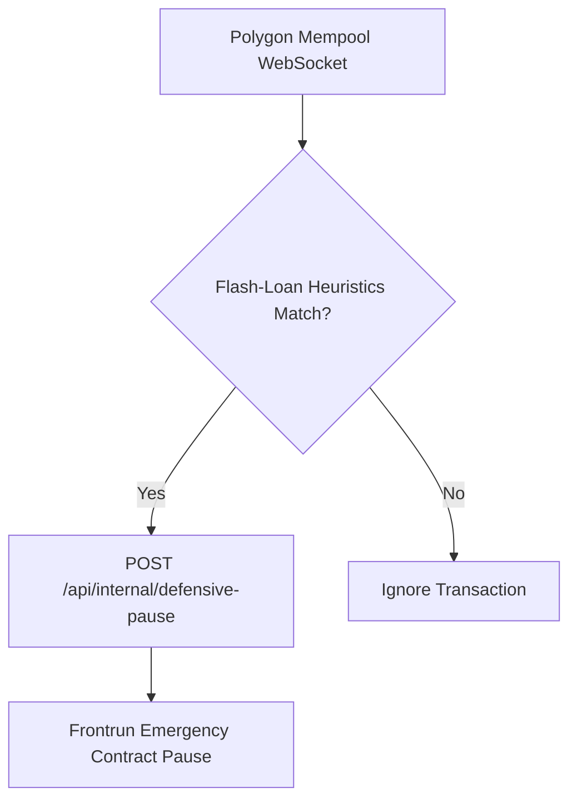

# 🛡️ Truxify Smart Contract Security Sentinel Workflow

This n8n workflow monitors pending Polygon mempool transactions to protect `TruxifyEscrow.sol` from flash-loan manipulation and re-entrancy attack profiles.

## Features
- Mempool real-time WebSocket ingestion
- High-gas anomalies detection
- Automated frontrun pause defense triggering

## Authentication
`POST /api/internal/defensive-pause` sits behind `requireApiKey` like every other
`/api/internal` route, so the pause node attaches the **Truxify Internal API Key**
`httpHeaderAuth` credential. Without it the API answers 401 and the defensive
pause never fires (#13925).

The endpoint is one-way: it only ever *opens* the escrow circuit breaker. Closing
it is an operator action — `POST /api/internal/pause-escrow {"paused": false}` —
which additionally requires the dedicated `ESCROW_OPERATOR_API_KEY` (a valid
internal API key alone is answered 403), so the shared automation credential can
never re-enable escrow submissions.

## Payload and failure handling
The pause node forwards `reason` (the matched heuristic and observed gas price)
and `txHash`, which the API records on the `DEFENSIVE_PAUSE_TRIGGERED` audit
event so an incident can be traced back to the triggering transaction.

The circuit breaker is Redis-backed and `isEscrowPaused()` fails closed: the
pause flag is an emergency control, so when Redis is unreachable the pause state
counts as active and on-chain escrow submissions are refused. In that state the
endpoint answers **503** — the n8n execution fails visibly instead of the
sentinel recording a defensive pause that was never persisted.

### Operator note: escrow pause state is an emergency control

- The escrow pause flag (Redis key `escrow:circuit-breaker:paused`) is an
  **emergency control** that refuses all on-chain escrow submissions while set.
- If Redis cannot be read (unreachable, or the read errors), the pause state is
  considered **active/paused** — `isEscrowPaused()` fails closed.
- Escrow submissions therefore **fail closed** while the state is unreadable.
- Operators must **restore/verify Redis and the pause state** before normal
  escrow operation resumes: confirm Redis is reachable, check
  `GET /api/internal/escrow-velocity` for `escrowPaused`, and close the circuit
  explicitly via `POST /api/internal/pause-escrow {"paused": false}` when the
  incident is over.
